<a name="readme-top"></a>


<!-- PROJECT LOGO -->
<br />
<div align="center">
  
	<h3 align="center">Akdeniz University Internship System</h3>
</div>

<!-- TABLE OF CONTENTS -->
<details>
  <summary>Table of Contents</summary>
  <ol>
    <li>
      <a href="#introduction">Introduction</a>
    </li>
    <li>
      <a href="#built-with">Built With</a>
    </li>
    <li>
      <a href="#features">Features</a>
    </li>
    <li>
      <a href="#database-schema">Database Schema</a>
    </li>
    <li>
			<a href="#authentication-flow">Authentication Flow</a>
			<ul>
				<li>
					<a href="#login-page">Login Page</a>
				</li>
				<li>
					<a href="#protecting-routes">Protecting Routes</a>
				</li>
			</ul>
		</li>
    <li>
      <a href="#requesting-to-api">Requesting to API</a>
    </li>
    <li>
      <a href="#feature-examples">Feature Examples</a>
      <ul>
				<li>
					<a href="#creating-internships">Creating Internships</a>
				</li>
			</ul>
    </li>
    <li>
      <a href="#acknowledgements">Acknowledgements</a>
    </li>
  </ol>
</details>

## Introduction
The Internship System is a fullstack web application designed to streamline and manage internship programs. Built with cutting-edge technologies such as Next.js, .NET Core, and Microsoft Azure, it provides a seamless experience for both Akdeniz University students and administrators.

This project was found eligible and financed by **Tübitak** within the scope of [2209-A](https://tubitak.gov.tr/tr/burslar/lisans-onlisans/burs-programlari/2209-universite-ogrencileri-arastirma-projeleri-destekleme-programi) program.

<p align="right">(<a href="#readme-top">back to top</a>)</p>

## Built With
* [![Next][Next.js]][Next-url]
* [![.NET][.NET]][.NET-url]
* [![Microsoft Azure][Azure]][Azure-url]

<p align="right">(<a href="#readme-top">back to top</a>)</p>

## Features
- User authentication and authorization with Entra ID (formerly Active Directory).
- Apply for internships.
- Dashboard for administrators.
- Email companies to approve or decline applied internship.
- Track internship status and status history.
- Document upload and management.
- Multiple language support.
- Light and dark modes.

<p align="right">(<a href="#readme-top">back to top</a>)</p>

## Database Schema
<div align='center'>
	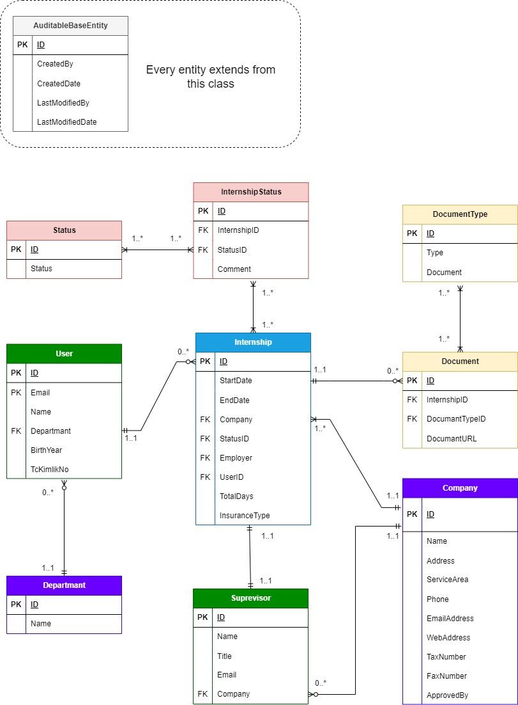
</div>

We created our entities based on this db schema. Used **Entity Framework** to use defined entities accross the application and migrate/push db to Azure. All entities extend from AuditableBaseEntity, which contains necessary properties for all entities inside our application.

```cs
using System;

namespace Internships.Core.Entities
{
    public abstract class AuditableBaseEntity
    {
        public virtual int Id { get; set; }
        public string CreatedBy { get; set; }
        public DateTime Created { get; set; }
        public string LastModifiedBy { get; set; }
        public DateTime? LastModified { get; set; }
    }
}
```

Since we use a relational database, we need entities work as a bridge between **many-to-many** relationships. This process requires foreign keys and collections to inform Entity Framework that this property represent many-to-many relationship.

For example, we need to keep status history for all internships, so we connect Internship and Status entities via InternshipStatus entity

```cs
using Internships.Core.Enums;
using System;
using System.Collections.Generic;

namespace Internships.Core.Entities
{
    public class Internship : AuditableBaseEntity
    {
        public Internship()
        {
            InternshipStatuses = new List<InternshipStatus>();
            ...
        }
        ...
        public ICollection<InternshipStatus> InternshipStatuses { get; set; }
        ...
    }
}
```

```cs
namespace Internships.Core.Entities
{
    public class InternshipStatus : AuditableBaseEntity
    {
        public int InternshipId { get; set; }
        public virtual Internship Internship { get; set; }
        public int StatusId { get; set; }
        public virtual Status Status { get; set; }
        ...
    }
}
```

```cs
using Internships.Core.Enums;
using System.Collections.Generic;

namespace Internships.Core.Entities
{
    public class Status : BaseEntity
    {
        public Status() 
        {
            InternshipStatuses = new List<InternshipStatus>();
        }
        public string Name {  get; set; }
        public ICollection<InternshipStatus> InternshipStatuses { get; set; }
    }
}
```

We also defined these entities as types on frontend to get type safety accross application.

<p align="right">(<a href="#readme-top">back to top</a>)</p>

## Authentication Flow
We authenticated users through system provided by Azure Entra ID. If the user could not be found under Akdeniz University tenant, an error message will be shown to the user.

<div align='center'>
	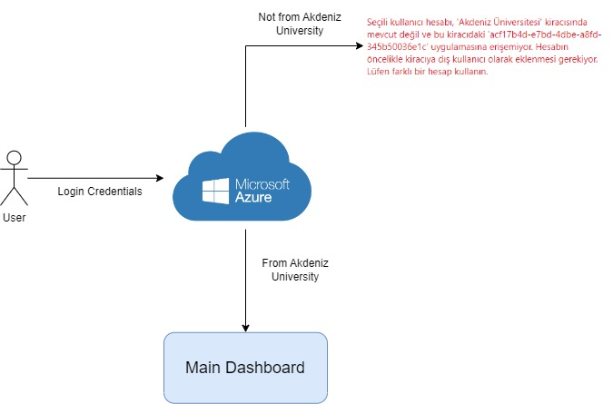
</div>

<p align="right">(<a href="#readme-top">back to top</a>)</p>

### Login page

<div align='center'>
	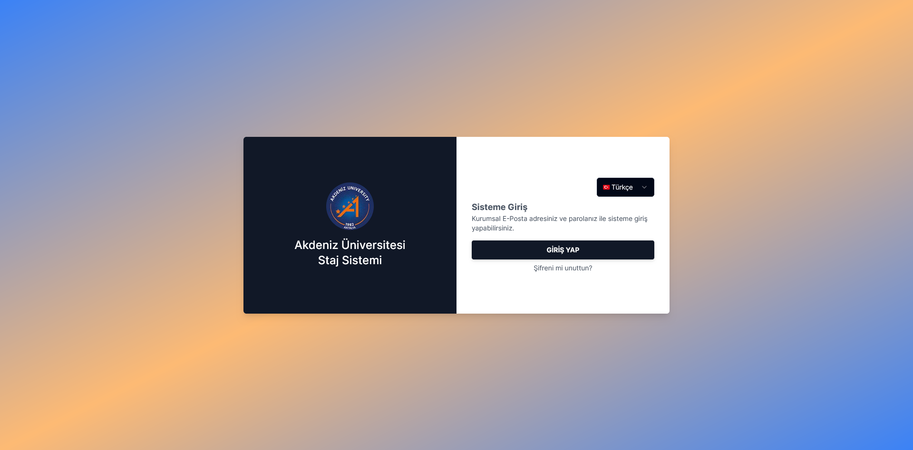
	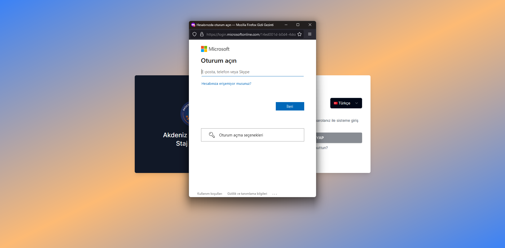
</div>

If popup is blocked by browser, login page open up in another tab.

<p align="right">(<a href="#readme-top">back to top</a>)</p>

### Protecting routes

Since routes are publicly open, we need to protect them. The useMsal hook prevents us to authenticate users on server side, so we used **Higher Order Components (HOC)** and **useLayoutEffect** hook to check if user is authenticated before the component renders.

```ts
'use client'

import { useIsAuthenticated } from '@azure/msal-react'
import { useRouter } from 'next/navigation'
import { useLayoutEffect } from 'react'

const authenticatedRouteWrapper = (WrappedComponent: any) => {
  const AuthenticatedWrapper = (props: any) => {
    const isAuthenticated = useIsAuthenticated()
    const router = useRouter()

    useLayoutEffect(() => {
      if (!isAuthenticated) {
        router.push('/')
      }
    }, [isAuthenticated, router])

    if (!isAuthenticated) return null

    return <WrappedComponent {...props} />
  }

  return AuthenticatedWrapper
}

export default authenticatedRouteWrapper

```

If we wrap a component with this HOC, then the useLayoutEffect mounts before wrapped component and navigates user to the login screen if not authenticated. 

Same logic also applies for admin routes, the difference is admin wrapper checks if the authenticated user has the same email in environment variable.

```ts
'use client'

import { useMsal } from '@azure/msal-react'
import { useRouter } from 'next/navigation'
import { useLayoutEffect } from 'react'
import authenticatedRouteWrapper from './AuthenticatedRouteWrapper'

const adminRouteWrapper = (WrappedComponent: any) => {
  const AdminWrapper = (props: any) => {
    const { accounts } = useMsal()
    const router = useRouter()
    const adminEmail = process.env.NEXT_PUBLIC_ADMIN_EMAIL

    const userEmail = accounts[0]?.username

    useLayoutEffect(() => {
      // Skip admin check if not in production
      if (process.env.NODE_ENV !== 'production') {
        return
      }

      if (userEmail !== adminEmail) {
        router.push('/main')
      }
    }, [userEmail, adminEmail, router])

    // Allow access if not on production
    if (process.env.NODE_ENV !== 'production') {
      return <WrappedComponent {...props} />
    }

    if (userEmail !== adminEmail) {
      return null
    }

    return <WrappedComponent {...props} />
  }

  return authenticatedRouteWrapper(AdminWrapper)
}

export default adminRouteWrapper

```

<p align="right">(<a href="#readme-top">back to top</a>)</p>


## Requesting to API

Api endpoints Authorized by entra id. When a request delivered, controller checks if it contains a valid Bearer token and process accordingly.

I modified [useFetchWithMsal hook](https://github.com/Azure-Samples/ms-identity-javascript-react-tutorial/blob/main/3-Authorization-II/1-call-api/SPA/src/hooks/useFetchWithMsal.jsx) created by microsoft to use typescript and also accept files inside body.

```ts
import { useState, useCallback } from 'react'

import { InteractionType } from '@azure/msal-browser'
import { useMsal, useMsalAuthentication } from '@azure/msal-react'
import { Method } from 'axios'
import { tokenRequest } from '@/config/authConfig'

const useFetchWithMsal = () => {
  const { instance } = useMsal()
  const [isLoading, setIsLoading] = useState<boolean>(false)
  const [data, setData] = useState()
  const [error, setError] = useState<any>()

  const { result, error: msalError } = useMsalAuthentication(
    InteractionType.Silent,
    tokenRequest,
    {
      ...instance.getActiveAccount()
    }
  )

  /**
   * Custom hook to call a web API using bearer token obtained from MSAL
   * @param {Method} method
   * @param {string} endpoint
   * @param {any} body
   * @returns
   */
  const execute = async (method: Method, endpoint: string, body?: any) => {
    if (msalError) {
      setError(msalError)
      console.log(msalError)
      return
    }

    const { accessToken } = await instance.acquireTokenSilent(tokenRequest)

    if (instance.getActiveAccount()) {
      try {
        let response = null

        const headers = new Headers()
        const bearer = `Bearer ${accessToken}`
        headers.append('Authorization', bearer)

        // Only append Content-Type if the body is not FormData
        if (!(body instanceof FormData)) {
          headers.append('Content-Type', 'application/json')
        }

        let options: RequestInit = {
          method: method,
          headers: headers,
          body: body instanceof FormData ? body : JSON.stringify(body)
        }

        setIsLoading(true)

        response = await (await fetch(endpoint, options)).json()
        setData(response)

        setIsLoading(false)
        return response
      } catch (e: any) {
        setError(e)
        setIsLoading(false)
        throw e
      }
    }
  }

  return {
    isLoading,
    error,
    data,
    execute: useCallback(execute, [result, msalError, instance]) // to avoid infinite calls when inside a `useEffect`,
  }
}

export default useFetchWithMsal
```

Instead of authenticating via Popup like in the original version, it acquires a silent token, only then execute method can be used. Execute method appends necessary headers to the request and sends it to backend enpoint. Every query and mutation sends request with this hook, thus we can say it acts like a wrapper for api calls.

<p align="right">(<a href="#readme-top">back to top</a>)</p>

## Feature Examples

### Creating Internships

<div align='center'>
	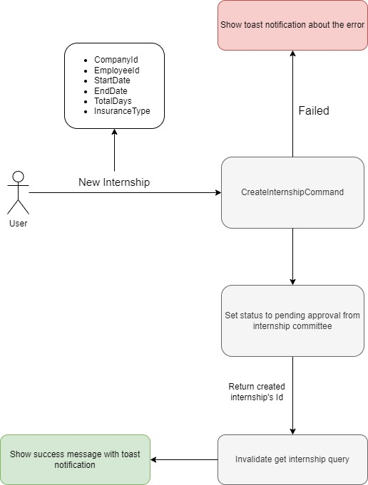
</div>

For a user to create an internship, required informations are
* CompanyId
* EmployeeId
* StartDate
* EndDate
* TotalDays
* InsuranceType

The request with body includes required fields send to the endpoint and it passes the request to the CreateInternshipCommand. This command do some validations such as whether entities with the given ids are present, starting date is before the ending date and etc.

If the request fails one of these validations, an exception will be thrown and catched by middleware to send a response with message appended to the body. Otherwise, it creates the internship, sets a new status as PendingApprovalFromInternshipCommittee and adds the new instance to the database.

If the database update is successful, the created internships id will be returned as response. When the response recieved by frontend, onSuccess method runs and invalidates the query with the queryKey "get-internships-by-userId".

Every feature runs with the same logic which enhances code readability and make it easy to refactor. My main purpose was to abstract every possible feature and evaluate maximum reusability to make revisions more easily.

<p align="right">(<a href="#readme-top">back to top</a>)</p>

<details>
  <summary>Screenshots</summary>
  <div align='center'>
	  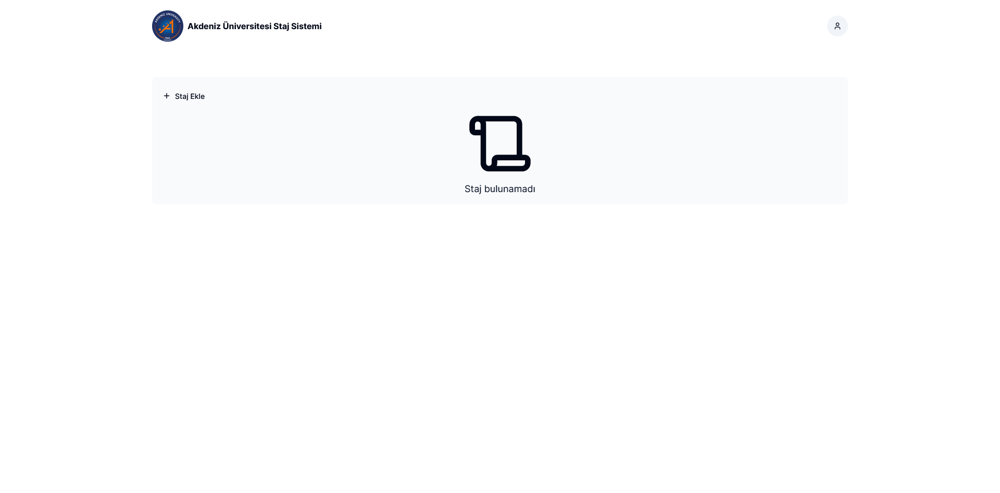
    <em>Empty main page</em>
	  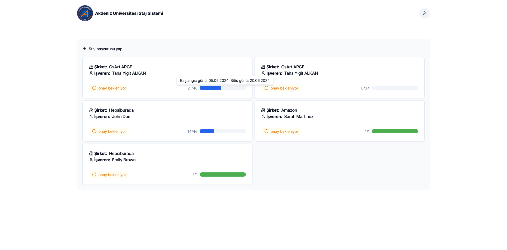
    <em>Main page with internships</em>
	  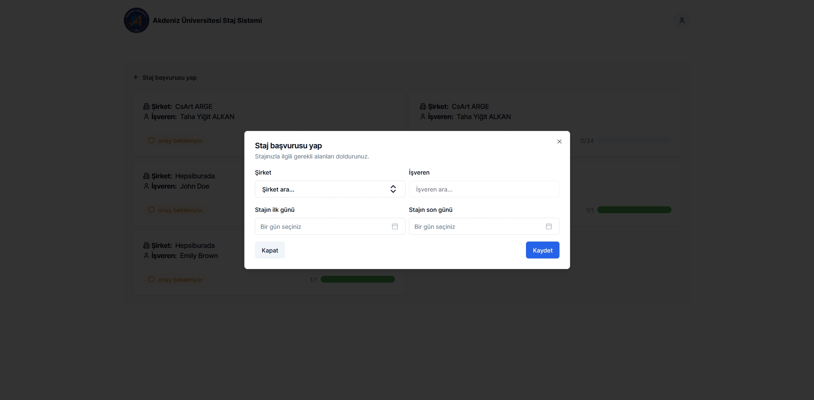
    <em>Add internship dialog</em>
	  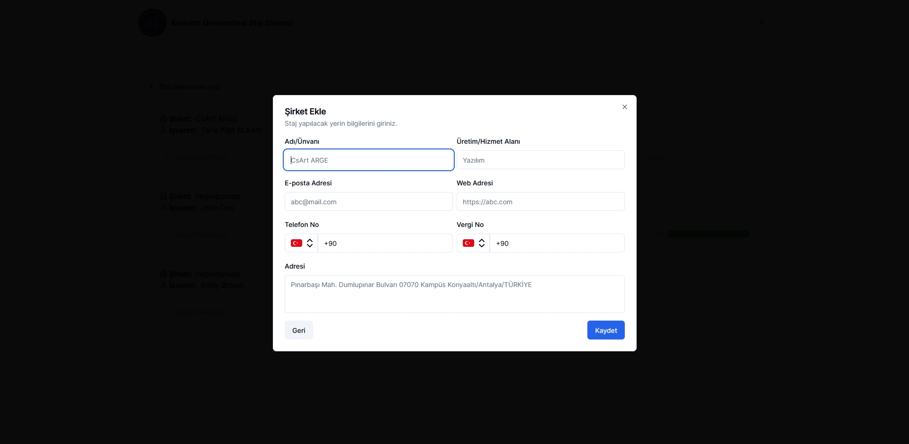
    <em>Add company dialog</em>
	  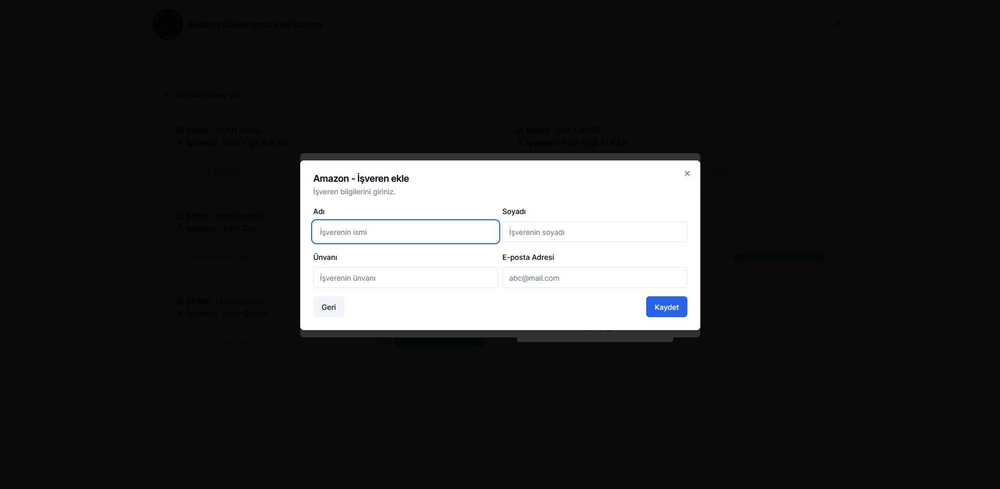
    <em>Add employee dialog</em>
	  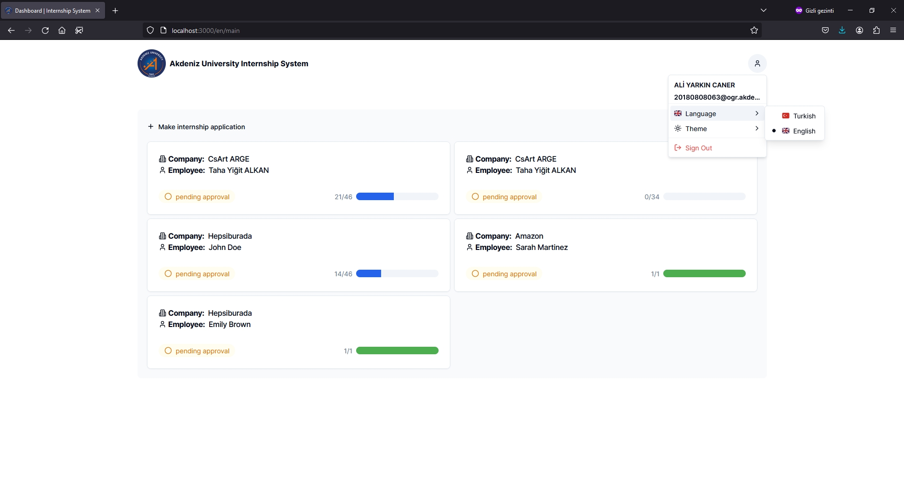
    <em>Navbar - languages</em>
	  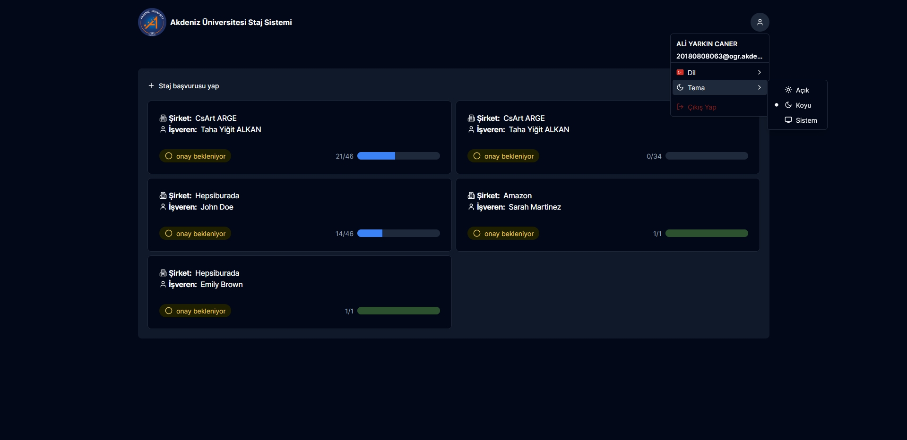
    <em>Navbar - themes</em>
	  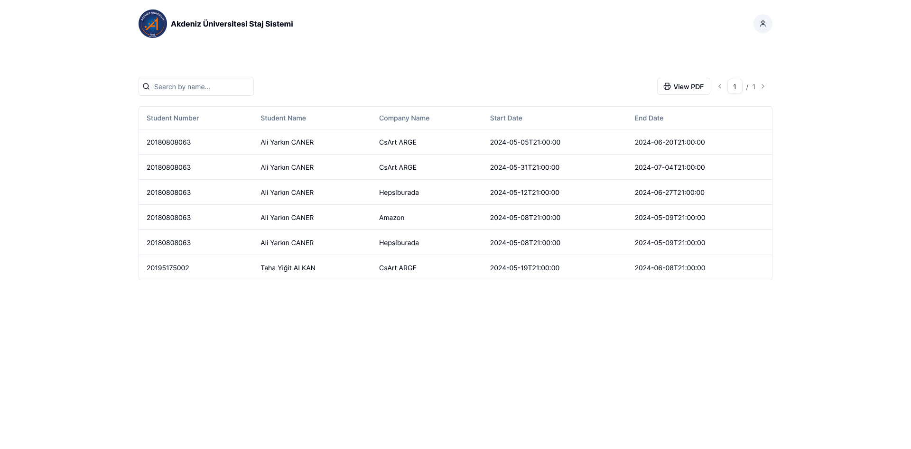
    <em>Admin - Internships</em>
	  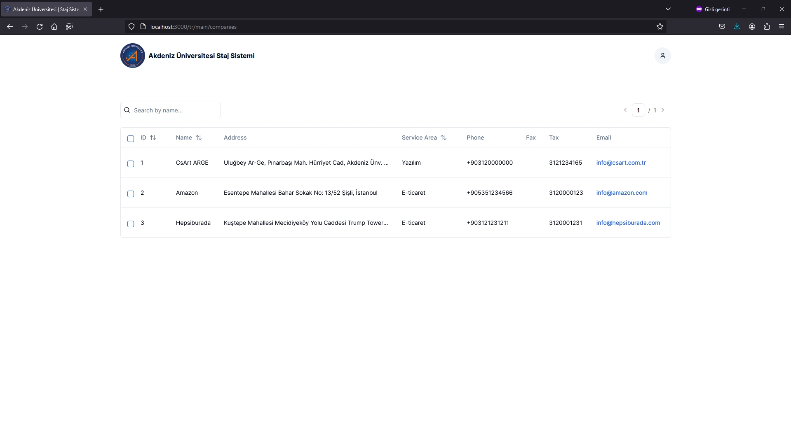
    <em>Admin - Companies</em>
	  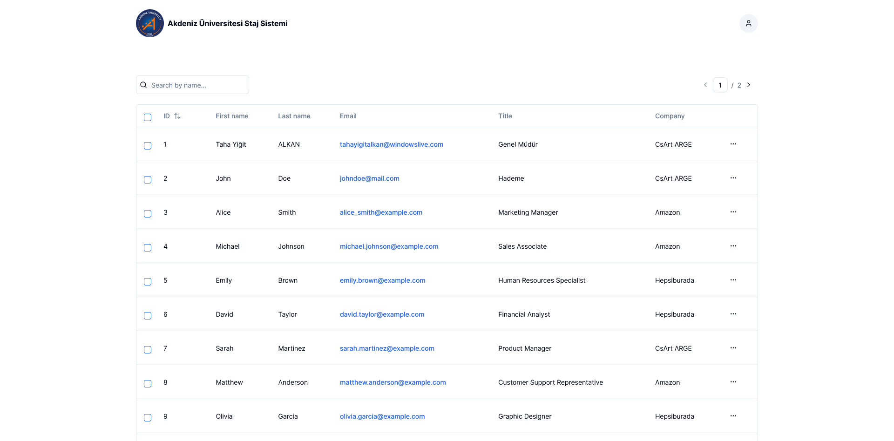
    <em>Admin - Employees</em>
  </div>

  <p align="right">(<a href="#readme-top">back to top</a>)</p>
</details>

## Acknowledgements
I would like give my special thanks to [Taha Yiğit Alkan](https://www.linkedin.com/in/taha-yigit-alkan), [Mustafa Esen](https://github.com/Mesen1100), [Özlem Şençoruh](https://github.com/ozzlems), and [Alper Özcan](https://www.linkedin.com/in/alper-ozcan-66955044) as I would not be able to complete this project without their help.

<p align="right">(<a href="#readme-top">back to top</a>)</p>


[Next.js]: https://img.shields.io/badge/next.js-000000?style=for-the-badge&logo=nextdotjs&logoColor=white
[Next-url]: https://nextjs.org/
[.NET]: https://img.shields.io/badge/.NET-512BD4?style=for-the-badge&logo=dotnet&logoColor=white
[.NET-url]: https://dotnet.microsoft.com/en-us/
[Azure]: https://img.shields.io/badge/microsoft%20azure-0089D6?style=for-the-badge&logo=microsoft-azure&logoColor=white
[Azure-url]: https://azure.microsoft.com/en-us